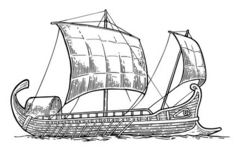

# Ulysses 

<!-- badges: start -->

[](https://app.codecov.io/gh/OHDSI/Ulysses?branch=main) [](https://github.com/OHDSI/Ulysses/actions?query=workflow%3AR-CMD-check)

<!-- badges: end -->

Ulysses is part of [HADES](https://ohdsi.github.io/Hades/)


# Introduction

Ulysses is an R package that automates setup of an OHDSI study and provides functions to assist with its maintenance and organization.

# System Requirements

Requires R (version 4.1 or higher)

# Installation

1. See the instructions [here](https://ohdsi.github.io/Hades/rSetup.html) for configuring your R environment, including RTools and Java.

2. In R, use the following commands to download and install Ulysses:

  ```r
  install.packages("remotes")
  remotes::install_github("ohdsi/Ulysses")
  ```
3. Install [quarto](https://quarto.org/docs/get-started/index.html)

# User Documentation

Documentation can be found on the [package website](https://ohdsi.github.io/Ulysses/).

PDF versions of the documentation are available:

- Vignette: [Ulysses Intro](https://raw.githubusercontent.com/OHDSI/Ulysses/main/extras/pdf_vignette/start_study.pdf)
- [Package manual](https://raw.githubusercontent.com/OHDSI/Ulysses/main/extras/Ulysses.pdf)

# Support

-   Developer questions/comments/feedback: <a href="http://forums.ohdsi.org/c/developers">OHDSI Forum</a>
-   We use the <a href="https://github.com/OHDSI/Capr/issues">GitHub issue tracker</a> for all bugs/issues/enhancements

# Contributing

Read [here](https://ohdsi.github.io/Hades/contribute.html) how you can contribute to this package.

# License

Ulysses is licensed under Apache License 2.0

# Development

Ulysses is being developed in R Studio.

