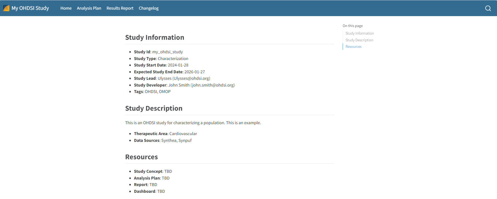
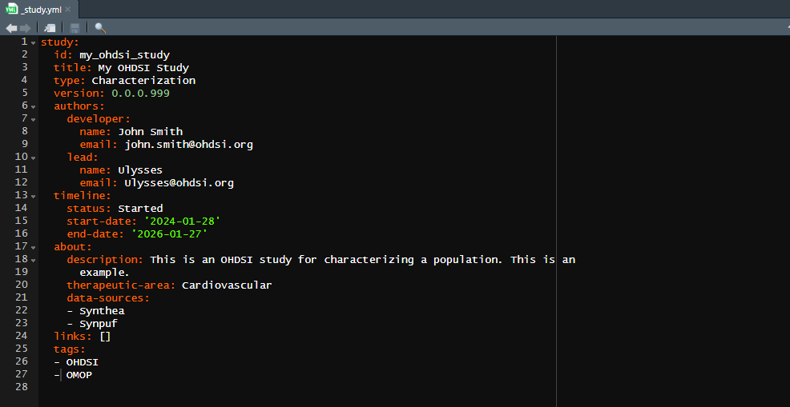

```{r, include = FALSE}
knitr::opts_chunk$set(
  collapse = TRUE,
  comment = "#>"
)
```

```{r setup}
library(Ulysses)
```

# Introduction

Running an OHDSI study contains lots of organizational complexity in terms of organizing code and proper documentation to communicate the code. While examples for constructing OHDSI studies have been presented, for example the SOS challenge, there is no clear workflow towards developing an OHDSI study as a piece of software available in a github repository. The OHDSI community would benefit from a workflow tool that will help standardize the development of network studies and improve its organization. This gap led to the development of a new R package called `Ulysses` (Useful Learning Yielded Structuring and Setting Epidemiology Studies) dedicated towards assisting in the development of an OHDSI study.

Ulysses draws inspiration from the R package [`usethis`](https://usethis.r-lib.org/), which is a workflow tool used for the development of R packages. Similar to OHDSI studies, there are several administrative steps and procedures required to develop a stable and transparent R package. `usethis` helps R programmers navigate R package development by supplying functions that automate simple tasks or other useful steps needed to meet this goal. Ulysses can provide a similar solution for OHDSI studies, improving the organization, communication and development of OHDSI studies by supplying simple functions to guide developers towards a study that is transparent, robust and reproducible. The OHDSI community would benefit from a tool that enforces standards and organization in OHDSI studies because it makes it easier for study nodes to execute network studies from a recognizable structure and provide guidance to new researchers seeking to build an OHDSI study if they follow a common workflow. In this software demo, we will showcase an example of how Ulysses can be used to start a new OHDSI study and help initiate necessary tasks for organizing and communicating the study to the OHDSI data network.

In this vignette we walk-through how to build an OHDSI study using the `Ulysses` package. We review:

-   Initializing a study in R
-   Adding repo documentation
-   Handling database credentials
-   Adding R scripts
-   Providing documentation about the study

# Initializing an OHDSI study in R

Once you have downloaded the `Ulysses` package, you can begin creating an OHDSI study. To do this, you can run code as shown in the block below:

```{r initStudy, echo=TRUE, eval=FALSE}
newOhdsiStudy(
  path = here::here("my_ohdsi_study"),
  studyInfo = setStudyInfo(id = basename(here::here("my_ohdsi_study")),
                           title = "My OHDSI Study"),
  authors = setStudyAuthors(
    developer = "John Smith",
    developerEmail = "john.smith@ohdsi.org"
  ),
  about = setStudyDescription(
    desc = "This is an OHDSI study for characterizing a population. This is an example.",
    ta = "Cardiovascular",
    dataSources = list("Synthea", "Synpuf")
  ),
  tags = setStudyTags("OHDSI", "OMOP")
)
```

This function will print some information to your console about start-up tasks and open an R project in a new session, for details on Rstudio projects see [link](https://r-pkgs.org/workflow101.html#sec-workflow101-rstudio-projects).

The additional inputs of the `newOhdsiStudy` function build meta data for the study repository that will be stored in a `_study.yml` file. This meta data serves two purposes: 1) provides human-readable information about the study and 2) serves as a source of information to populate fields for templated files generated using `Ulysses`. For example, if we were to generate a `README` file using `Ulysses` it would be built using this meta information. 

# Ulysses Directory structure

In a new R session, users will notice a pre-populated directory structure in their project folder. This directory structure contains specific folders and files that are important for a study to be self-contained within the new R project. 


`Ulysses` builds the following folders:

### `analysis`

The analysis folder contains files that correspond to study analysis. There are three main folders created. 

* `src` - contains the underlying functions that execute the analysis. These files can be R scripts, sql files or python scripts, for example. With `Ulysses`, users can generate templated internal R files using the command `makeInternals`.
* `tasks` - hold the executing scripts that generate the results of the study. With `Ulysses`, we think of studies as a series of tasks implemented in a specific order, like a pipeline. The `tasks` folder organizes these individual tasks. With `Ulysses`, users can generate templated internal R files using the command `makeAnalysisScript`.
* `migrations` - contain post-processing scripts to move and prepare data from a series of results to a format that is "presentation ready". When conducting studies in OMOP, it is common to run the same analysis on different databases. Migration scripts help bind the results of all databases run in the study and format tables to present in a quarto report or shiny app. With `Ulysses`, users can generate templated internal R files using the command `makeMigrationScript`.


### `cohorts`

The cohorts folder is meant to organize files that are used to generate cohort definitions in the database. In an OHDSI study, cohort definitions are specified in a `json` file format following the specifications of [`circe-be`](https://github.com/OHDSI/circe-be). We suggest placing cohorts used in the analysis in the cohort folder in order for the study to be self-contained, meaning it does not rely on ATLAS to execute. However, we **highly** recommend that users maintain the organization of their cohorts in ATLAS as a source of truth for both cohort definition and generation. The `sql` folder is created to store sql files used to build cohort definitions. This is a good location for cohort definitions that do not follow the `circe-be` structure. 

Keeping track of cohorts can be a bit tricky. `Ulysses` provides a helper function to track json files in the cohorts folder called `cohortManifest`. This function will list the name of the json file and its corresponding id. By default, the cohort Id assigned to the cohort json is in alphabetical order starting with 1. `Ulysses` also creates a file called the `CohortDetails.qmd` which prints the human-readable rendering of the json expression using [`CirceR`](https://github.com/OHDSI/CirceR). **These functions are still in development as of v0.0.4**.

### `documentation`

Study repositories should not only contain code, they should also contain documentation about the design of the study and how to run the study. Study repo's should be self-contained, meaning we can go to one location to get all code and human-readable documentation about the study. `Ulysses` builds this into its repository structure with a `hub` folder and a `misc` folder. The `hub` folder contains files that are specific to the study hub, an html website that provides all information about the study. The `misc` folder is a place-holder to store word documents, excel files, slide decks or other important documentation needed for the study. 

#### Study Hub

The study hub is a website that a user can generate through `Ulysses` that provides information about the design of a study and its results. The study hub is generated using `quarto`. The study hub can be generated using the function `buildStudyHub`. The study hub relies on the generation and maintenance of 4 files: README.md, NEWS.md, AnalysisPlan.qmd and ResultsReport.qmd. 



#### Suggested Files

`Ulysses` has functions to initialize some suggested files for a study:

* `AnalysisPlan.qmd`: the statistical analysis plan for the study, which specifies the study design and analytical methods. This file can be templated in `Ulysses` using the command `makeAnalysisPlan`.
* `ResultsReport.qmd`: the report summarizing results from the study following its execution. This file can be templated in `Ulysses` using the command `makeResultsReport`.
* `ContributionGuidelines.qmd`: if the study is a network studies, maintainers should provide resources on how others can contribute to the study. Topics ranges from how to file issues, how to send results to the study host, and how to collaborate in a positive environment. This file can be templated in `Ulysses` using the command `makeContributionGuidelines`.
* `HowToRun.qmd`: a document that explains how to execute the study code to study nodes or interested parties. Should describe technical requirements needed prior to running the study, local setup, and execution. This file can be templated in `Ulysses` using the command `makeHowToRun`.


## `exec` 

The `exec` folder is a location to store output files that result from the study execution. This includes results and logs from the study run and a folder to store post-processed data called `export`. The `exec` folder is always ignored in git. 

## `extras`

Sometimes studies have files that don't have a natural location from those specified above. The `extras` folder is a location to store any additional files needed to run or support the execution of the study. This is also a good location to store internal setup scripts, but remember to ignore them in git. 

# Additional Repository Files

In addition to the pre-generated folders in the new study repository, `Ulysses` also helps generate additional files that should be in the repository. Some of these key files are described below. 

### `_study.yml`

A file unique to directories initialized using `Ulysses` is a metadata file called `_study.yml`. Using the inputs specified in the `newOhdsiStudy` function, a metadata file is populated. As mentioned this file store information about the study directory and also uses it as inputs to templated files generated in `Ulysses`. It is important to maintain this file during the development of a study, whether that is to update default fields in the yaml file or add information. Below is a snapshot of a `_study.yml` file with the essential metadata fields.



#### Fields

Below we describe the key fields in this file. 

* id: an identifier for the study which is the same as the directory name. Use either a study id or acronym
* title: a full title for the study, more thorough than the id. If no title is provided, the input defaults to the id.
* type: a keyword describing the type of study being conducted. Could be a **Characterization**, **Population-Level Estimation**, **Patient-Level Prediction**, or **Database Assessment**, for example.
* version: a value that represents the version of the study. Suggest using semantic versioning logic. 
* authors: stores the name and email of the developer (person in-charge of code development) and the lead (person in-charge of the study). You may add other authors who are designated as *members*
* timeline: a list of information relating to the development timeline of the study. This includes the study start and end dates. The study status is also listed here, where acceptable values are **Started**, **In-Progress**, **Stopped** and **Completed**. 
* about: a short description about the study, the therapeutic area it covers and data sources used.
* links: a listing of hyperlinks to guide people to key documentation such as the analysis plan, report, dashboard and other resources.
* tags: a list of keyword identifiers for the project

#### Maintenance 

`Ulysses` provides functions to maintain the `_study.yml` file.

* Add Fields
    - `addStudyMember()`
    - `addTags()`
    - `addDataSources()`
    - `addLinks()`

* Update Fields
    - `updateStudyEndDate()`
    - `updateSutdyStatus()`
    - `updateStudyTitle()`
    - `updatStudyVersion()`
    - `updateStudyDescription()`
    - `updateTherapeuticArea()`
    - `updateDeveloperInfo()`
    - `updateLeadInfo()`

### `README.md`

For those unfamiliar with code development, the **README** file is a standard file used to introduce the contents of a repository, like a cover-page. It is the first file users see when they navigate to the repository page in your repository hosting service (i.e. BitBucket or Github). Therefore a strong README file is essential for a study. `Ulysses` provides the function `makeReadMe()` which initializes the README using inputs from the metadata stored in the `_study.yml`. 


Another feature offered by `Ulysses` is support for svg badges. These simple badges appear at the top of the README and provide useful information about the study. Badges seen in OHDSI studies include a study status badge and badges versioning the CDM and OMOP vocabulary. `Ulysses` will provide more support and documentation for badges in the future.

### `NEWS.md`

Another common file in software repositories is the NEWS file. The purpose of the NEWS file is to track changes to the software over time. Of course, version control software such as github keeps a record of the iterations of the study as it is developed, however it is helpful to have a "plain english" file that explains what has happened as the study has developed over time. NEWS files are often maintained via a [semantic versioning](https://semver.org/) system. OHDSI studies are not entirely software, however it is important to maintain order over the development of the technical pieces of the study. `Ulysses` offers a simple function that initiates this file, `makeNews()`.


### `config.yml` 

An important aspect of running an OHDSI study is handling credentials to connect to the Database Management System (DBMS) that hosts the OMOP data. Security of these credentials is very important. `Ulysses` offers support on handling these credentials through the `config.yml` file. Credentials needed to run a study are as follows:

-   **dbms**: the name of the dbms used to host the OMOP data
-   **user**: your user name needed to access the data in the dbms
-   **password**: your password needed to access the data in the dbms
-   **connectionString**: this string sets the connection to the database. It will typically look something like: `jdbc:<dbms>://<server url>:<dbms port>/<database>`. This string will vary from site to site. Contact your system administrator to get the information you need for this credential
-   **cdmDatabaseSchema**: a name that defines where the cdm tables sit for a particular database in the dbms. `Database` defines the name of the database where the omop data sits and the `Schema` defines where the cdm is within that database. In databases like sql server or snowflake this variable is often separated by a "." i.e. \`<database>.<schema>
-   **vocabDatabaseSchema**: a name that defines where the vocabulary tables sit for a particular database in the dbms. The vocabDatabaseSchema is typically the same as the cdmDatabaseSchema, although same sites split the vocabulary into a different area.
-   **workDatabaseSchema**: a name that defines where the work tables sit for a particular database in the dbms. The work section (referred to synonymously with scratch or write) is an area where the user is given read and write access in the database. The cdmDatabaseSchema is typically only a read-only schema, so users do not corrupt information. The workDatabaseSchema is a dedicated area where researchers can build cohort tables or other intermediary tables needed for studies. Contact your database administrator to ensure you have a dedicated workDatabaseSchema. Note this should be separate from the database schema dedicated to ATLAS.

Often times sites require additional credentials such as database roles or other parameters used to define tempEmulationSchemas, for example. You can add these parameters manually in the `Ulysses` workflow, shown later. Be sure to contact your database administrator to have all these credentials handy before running a study.

Now that you have collected your credentials we need to store them somewhere secure to be accessed continuely within the study. `Ulysses` does this using a *config.yml* file. [Yaml](https://yaml.org/) is a simple, readable data-serialization language used to provide settings or configurations for applications. For those familiar with R, the *config.yml* file works similarly to an `.Renviron` file. But wait, there is more to the *config.yml* file! The credentials are further protected via [`keyring`](https://github.com/r-lib/keyring) API. `keyring` stores your credentials behind a password. We use `keyring` and `config` together to ensure that users do not accidentally expose passwords when working on a study. `Ulysses` provides a function that initializes the *config.yml* file:

```{r configSetup, echo=TRUE, eval=FALSE}
Ulysses::makeConfig(block = "example", database = "synpuf_110k")
```

When a user creates a new `config.yml` file it is added to `.gitignore` to ensure it is not committed to a github repository. The config file shows each credential connected to the block name.

```         
# Config File for my_ohdsi_study

default:
  projectName: my_ohdsi_study

# Config block for example

example:
  databaseName: example
  cohortTable: my_ohdsi_study_example
  dbms: !expr keyring::key_get('example_dbms', keyring = 'my_ohdsi_study')
  user: !expr keyring::key_get('example_user', keyring = 'my_ohdsi_study')
  password: !expr keyring::key_get('example_password', keyring = 'my_ohdsi_study')
  connectionString: !expr keyring::key_get('example_connectionString', keyring = 'my_ohdsi_study')
  cdmDatabaseSchema: !expr keyring::key_get('example_cdmDatabaseSchema', keyring = 'my_ohdsi_study')
  vocabDatabaseSchema: !expr keyring::key_get('example_vocabDatabaseSchema', keyring = 'my_ohdsi_study')
  workDatabaseSchema: !expr keyring::key_get('example_workDatabaseSchema', keyring = 'my_ohdsi_study')
```

If we wanted to add another credential in this block we can add new line beneath `workDatabaseSchema`. Be sure to keep the indentation and add an extra space after.  To set up the keyrings, `Ulysses` also supplies a helper script to set this up. Follow the script to set up the keyring credentials so that the *config.yml* can be properly used. 

```{r keyringSetup, echo=TRUE, eval=FALSE}
Ulysses::makeKeyringSetup(configBlock = "example", database = "synpuf_110k")
```

