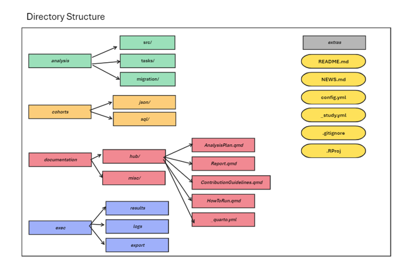

```{r, include = FALSE}
knitr::opts_chunk$set(
  collapse = TRUE,
  comment = "",
  message = FALSE,
  echo = FALSE
)
```

```{r setup}
library(Ulysses)
```


# Introduction

Running an OHDSI study is exciting effort that can lead to meaningful new evidence on clinical questions across a network of study participants who have data mapped to the OMOP CDM. However, there are a lot of tasks to keep track to make an OHDSI study successful. We introduce the `Ulysses` R package, as a tool to assist in the development and organization of an OHDSI study. The idea of the `Ulysses` package is inspired by the [`usethis` package](https://usethis.r-lib.org/) that is used to assist in the development workflow of novel R packages and projects alike. Similar to the development of an R package, there are several steps and pieces of documentation needed in an OHDSI study to effectively run the study across the OHDSI network. By providing functions that automate tasks and provide consistent structure to OHDSI studies, `Ulysses` attempts to help users develop and communicate new OHDSI studies.

# Directory Structure

The first step towards assisting OHDSI studies is to introduce a consistent directory structure that contains also necessary components towards executing a study and is easy to follow. Below is a proposed directory structure, offered by the `Ulysses` package for OHDSI studies.




### Analysis Folder

The analysis folder contains files that are required for running an OHDSI study. There are three sub-folders: *private*, *settings* and *studyTasks*. The *studyTasks* folder contains files needed to run the OHDSI study. These could be several files in a pipeline (i.e. `01_buildCohorts.R`, `02_buildStrata.R`, `03_baselineCharacteristics.R`) or a single strategus json file that contains details of the modules to run. Next, the *settings* folder contains any files that provide details of the analysis settings. For example, this folder could contain scripts that specify the settings of an incidence analysis to run in the study. Likewise, this folder could contain the `createStrategusAnalysisSpecification.R` which creates the strategus json to run the analysis. Finally, the *private* folder contains any internal files needed to run the analysis. For example this could include internal functions to run a study script. The `Ulysses` package offers functions to help develop components of the analysis such as:

-   `makeAnalysisScript`: initializes an organized .R file, pre-rendered with details about the analysis.
-   `makeInternals`: creates a .R file used for developing internal functions.

### Cohorts to Create Folder

OHDSI studies revolve around generated cohort definitions used to enumerate persons with a particular clinical occurrence (i.e. persons prescribed ACE Inhibitors for first time). Keeping track of these cohort definitions, is very important for a successful OHDSI study. Clinical phenotypes often change during the development of studies, so it is very important to keep the latest cohort definition json files organized. The *cohortsToCreate* folder stores all the json files of cohort definitions used in the study. They are organized in numbered folders that are listed at the developers description. By default, `Ulysses` creates a starting `01_target` folder to store the target cohort definitions of the study. `Ulysses` offers functions that support the organization of this folder, such as:

-   `makeCohortFolder`: initializes a new folder to store cohort definitions, i.e. a new folder for comparator cohorts
-   `makeCohortDetails`: a markdown file that provides "plain english" descriptions of the cohort definitions and tracks updates.

### Documentation Folder

An OHDSI study consists of lots of documentation that effectively communicate what the study is, how to run it and how to participate. There are three key files stored in this folder:

-   **Study Protocol**: the protocol offers guidance on the scientific methods used to conduct the study and justification for why scientific decisions were made. `Ulysses` auto-generates a skeleton file via `makeStudyProtocol`.
-   **How To Run**: a file is needed that provides all technical specifications and instructions needed to run the study at a site. This file provides information on how to download the OHDSI study, prepare the environment for running the study, executing the study and how to dissiminate the results to the study host. `Ulysses` auto-generates a skeleton file via `makeHowToRun`
-   **Contribution Guidelines**: a file is required to communicate how others can contribute to the study. Contributions can range from simply running the study to providing significant development. OHDSI studies require transparency to nodes on what are the rules and expectations for meaningful contribution to the study. `Ulysses` auto-generates a skeleton file via `makeContribution`

There exist scenarios when a full-fledged protocol is not required for a study. While a study protocol is not required by the institution running the study, it is still good practice to provide guidance on the scientific decision making for the study. `Ulysses` offers a skeleton file called the *Study Synopsis*, implemented via `makeStudySynopsis`, that gives structure to the methods and rationale for the study while not being as formal as a study protocol.

The documentation folder may also contain other files that are essential for communicating important aspects of the study.

### Results Folder

When an OHDSI study is executed, we require a location to store the results in an organized fashion. These results can be easily zipped and sent to the study host. `Ulysses` initializes a *results* folder that can be used as a target for the output. The results folder is automatically added to the `.gitignore` so that results are not accidentally committed to github repository of the OHDSI study. We intend to add functions to compliment the results folder in the future.

### Logs Folder

Running an OHDSI study is like executing a pipeline of tasks. It is vital that we know what is going on in the pipeline, whether an error has occurred or when an execution has taken place. Loggers are an important part of a pipeline and likewise an OHDSI study. `Ulysses` offers a folder to save logs in a single location. The log folder is is automatically added to the `.gitignore` so that results are not accidentally committed to github repository of the OHDSI study.

### Extras Folder

OHDSI studies sometimes contain files that are important to a study but do not have a natural save location; the extras folder hosts these files. A prime use for the extras folder is for scripts or files that are ancillary to the main study. For example scripts such as `KeyringSetup.R` are helpful for running the study but not core to the study itself. `Ulysses` offers functions that support the extras folder.

### \_study.yml

The final file initiated by `Ulysses` is the `_study.yml` file. This is a meta file that provides an overview of the study. It contains information about who is the study lead, the date the study started and the full name of the study. We plan to expand upon this meta file as we feel quality meta data for a study is useful for 1) automating start-up tasks and 2) providing records to users.


